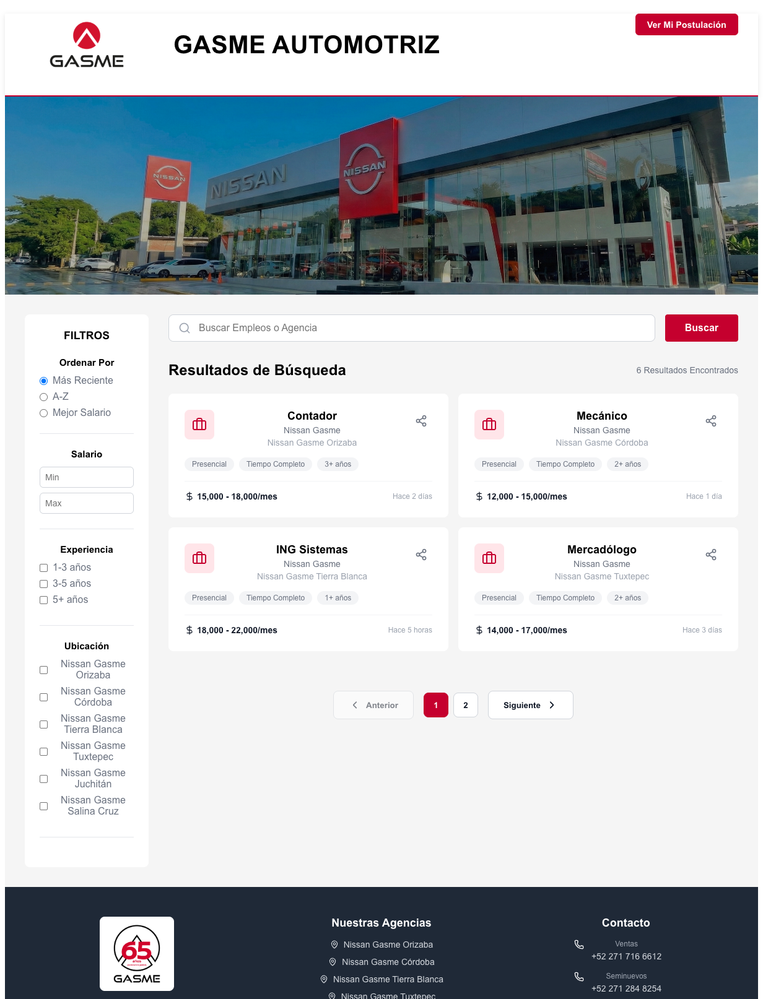
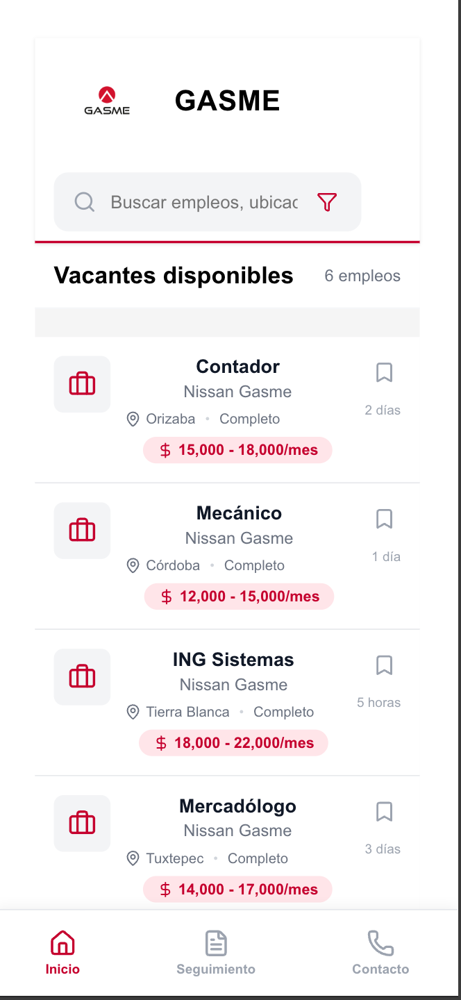

# Portal de Empleo "Gasme Automotriz" 🚗


Este es un portal de empleo moderno y funcional construido con **React** para el frontend y **Node.js/Express** para el backend, diseñado para que "Gasme Automotriz" (un concesionario de Nissan) pueda publicar sus vacantes y gestionar las solicitudes de los candidatos de manera eficiente.

## ✨ Características Principales

-   **Búsqueda y Visualización de Vacantes:** Interfaz principal con tarjetas de empleo claras y atractivas.
-   **Filtrado Dinámico:** Filtra las vacantes por palabra clave y **agencia/sucursal** sincronizada directamente desde la base de datos.
-   **Detalle de la Vacante:** Panel modal con descripción detallada del puesto, requisitos y beneficios del concesionario.
-   **Proceso de Aplicación Completo:** Formulario para que los candidatos ingresen sus datos y adjunten su CV.
-   **Confirmación por Correo:** Envío automático de correos electrónicos de confirmación tras cada postulación exitosa utilizando **SMTP (Nodemailer)**.
-   **Almacenamiento Dual de CV:** Respaldo de archivos CV tanto en el servidor local como en formato **BLOB** directamente en la base de datos PostgreSQL para mayor seguridad.
-   **Seguimiento de Postulación:** Funcionalidad para que los candidatos rastreen el estado de su solicitud con un código único generado automáticamente.
-   **Diseño Responsivo:** Interfaz optimizada para una experiencia perfecta en dispositivos de escritorio y móviles.

## 🚀 Tecnologías Utilizadas

### Frontend
-   **Framework:** 
-   **Herramienta de Build:** 
-   **Librería de Iconos:** `lucide-react`
-   **Estilos:** CSS puro (objetos de estilo en componentes)

### Backend
-   **Servidor:**  
-   **Base de Datos:** 
-   **Notificaciones:**  (SMTP Service)
-   **Gestión de Archivos:** `Multer` para la subida de CVs.

## 🛠️ Instalación y Configuración

El proyecto se divide en dos carpetas: raíz (Frontend) y `server/` (Backend).

### 1. Configuración del Backend
1.  Navega a la carpeta del servidor:
    ```bash
    cd server
    ```
2.  Instala las dependencias:
    ```bash
    npm install
    ```
3.  Configura las variables de entorno:
    Copia el archivo `.env.example` a `.env` y completa tus credenciales de base de datos y SMTP:
    ```bash
    cp .env.example .env
    ```
4.  Inicializa la base de datos (asegúrate de tener PostgreSQL corriendo):
    ```bash
    node init-db.js
    ```
5.  Inicia el servidor:
    ```bash
    node index.js
    ```

### 2. Configuración del Frontend
1.  Regresa a la raíz del proyecto:
    ```bash
    cd ..
    ```
2.  Instala las dependencias:
    ```bash
    npm install
    ```
3.  Inicia el servidor de desarrollo:
    ```bash
    npm run dev
    ```

## 🖼️ Vistas de la Aplicación

| Vista de Escritorio                                | Vista Móvil                               |
| -------------------------------------------------- | ----------------------------------------- |
|              |              |

---

Desarrollado con ❤️ para la gestión de talento en Gasme Automotriz.
